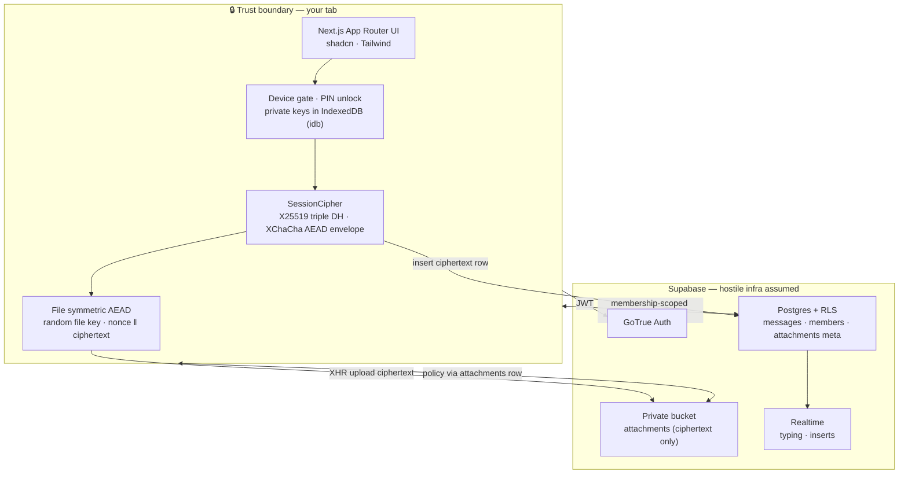
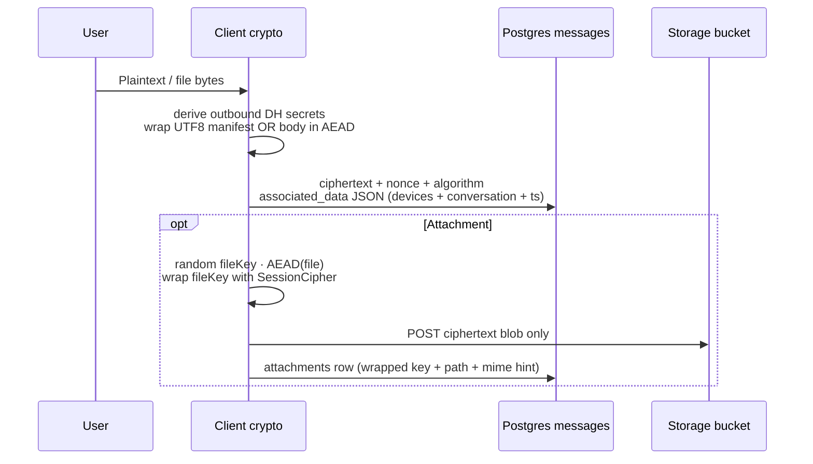

<!-- ═══════════════════════════════════════════════════════════════════════════
     SecureTalks · Maintainer: https://github.com/kulharshit21  ·  Solo project
     ═══════════════════════════════════════════════════════════════════════════ -->

<div align="center">

# 🔐 SecureTalks

**Private by design · encrypted before it leaves your device**

[](https://github.com/kulharshit21/SecureTalks)

[](https://nextjs.org/)
[](https://react.dev/)
[](https://www.typescriptlang.org/)
[](https://supabase.com/)
[](https://vitest.dev/)
[](https://libsodium.gitbook.io/)

<br/>

<sub><strong>Solo maintainer · research & architecture ·</strong> <a href="https://github.com/kulharshit21">@kulharshit21</a></sub>

</div>

---

## Snapshot

SecureTalks is a **premium-feel**, **privacy-forward web messenger**: plaintext stays inside an unlocked browser session; **Supabase** stores **only ciphertext**, structured AEAD metadata, and **encrypted blobs** in Storage. **Attachments** use an independent file key wrapped per-recipient. **Disappearing messages** set `expires_at`, hide rows via **RLS**, and ship with a **purge function** for scheduled cleanup.

> ⚠️ Disappearing timers reduce persistence—they **cannot stop screenshots**, malware on-device capture, or a compromised endpoint.

---

## Suggested GitHub metadata

Paste these under **About → Topics**:

```
end-to-end-encryption e2ee nextjs react typescript supabase libsodium privacy
x25519 xchacha20poly1305 encrypted-storage disappearing-messages realtime
```

**Short description (About → Description):**

> E2EE web messenger — libsodium session cipher, ciphertext-only Supabase, encrypted attachments, disappearing TTL — Next.js 16 & React 19.

---

## Architecture (animated mentally ✨ diagrams render live on GitHub)



---

## Encrypt path (high level)



---

## Threat model (honest)

| Surface | What the server sees | What it never sees |
|--------|----------------------|---------------------|
| `messages` | Ciphertext, nonce, protocol id, bound metadata JSON | Plaintext bodies |
| `attachments` | Storage path, wrapped **file key** blob (still ciphertext to infra without device secrets), MIME hint | Plain files |
| Client compromise | N/A — attacker reads decrypted UX same as user | — |

This is **not** a substitute for a full audited Signal deployment—it centralizes transport/metadata via Supabase. Read **`docs/SECURITY_RLS_CHECKLIST.md`** after migrating.

---

## Stack

| Layer | Choices |
|-------|---------|
| App | Next.js 16 · React 19 · Tailwind 4 · shadcn/ui patterns · lucide-react |
| Auth | Supabase Auth (+ SSR `@supabase/ssr`) |
| Crypto | libsodium-wrappers · session envelope + separate file AEAD domain |
| Data | Postgres RLS · Storage policies · optional pg cron purge |

---

## Quick start

```bash
git clone https://github.com/kulharshit21/SecureTalks.git
cd SecureTalks
npm ci
cp .env.example .env.local   # fill NEXT_PUBLIC_SUPABASE_* + redirect URLs
npm run dev
```

Apply SQL from `supabase/migrations/` via Supabase CLI or SQL editor (order matters).

### Scripts

| Command | Purpose |
|---------|---------|
| `npm run dev` | Local Next dev server |
| `npm run build` | Production build |
| `npm run test` | Vitest unit/crypto tests |
| `npm run test:e2e` | Playwright (configure env first) |
| `npm run lint` | ESLint |

---

## Scheduled expiry cleanup

After migrations, **`public.purge_expired_messages()`** deletes expired attachment objects then rows. Schedule with **Supabase pg_cron** or a trusted worker using **`service_role`** (already granted `EXECUTE` in migration).

---

## Maintainer

**Author & sole contributor:** [kulharshit21](https://github.com/kulharshit21)

---

<div align="center">

<sub>Built with intent · vibe-coded UI · research-backed crypto boundaries</sub>

</div>
