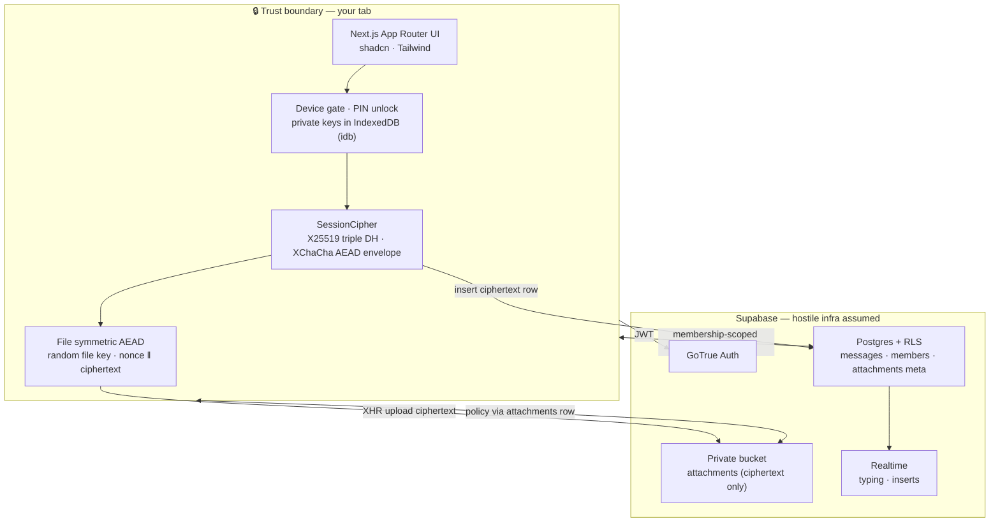
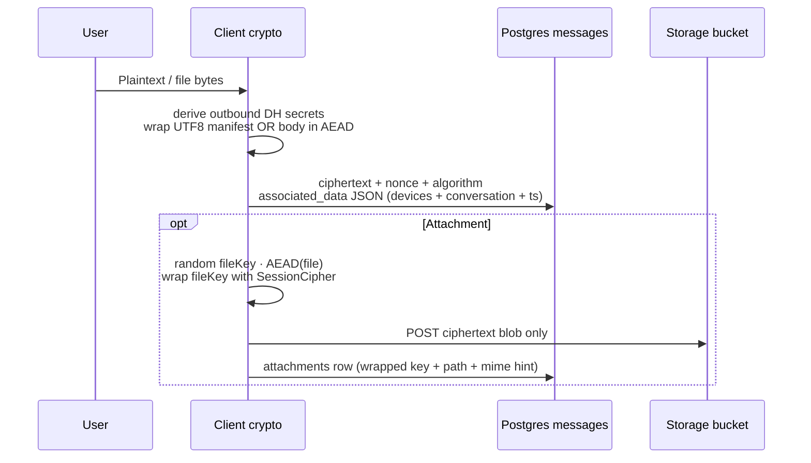

<!-- ═══════════════════════════════════════════════════════════════════════════
     SecureTalks · Maintainer: https://github.com/kulharshit21  ·  Solo project
     ═══════════════════════════════════════════════════════════════════════════ -->

<div align="center">

# 🔐 Privyra · SecureTalks

**Private conversations, made simple.** A privacy-first E2EE web messenger prototype (repo **SecureTalks**) with server-blind encrypted storage, identity verification, encrypted attachments, disappearing messages, and opt-in AI tools.

[](https://github.com/kulharshit21/SecureTalks)

[](https://nextjs.org/)
[](https://react.dev/)
[](https://www.typescriptlang.org/)
[](https://supabase.com/)
[](https://vitest.dev/)
[](https://libsodium.gitbook.io/)

<br/>

<sub><strong>Solo maintainer · research & architecture ·</strong> <a href="https://github.com/kulharshit21">@kulharshit21</a></sub>

</div>

---

## Snapshot

**Privyra / SecureTalks** is a **privacy-first encrypted messaging prototype**: plaintext stays in an **unlocked browser session**; **Supabase** holds **ciphertext**, AEAD metadata, and **encrypted** Storage blobs. **Attachments** (encrypt-then-upload) use the private **`encrypted-attachments`** bucket for **direct** chats — group attach remains **incomplete** in UI. **Disappearing messages** combine `expires_at`, **RLS**, **`purge_expired_messages()`**, and **`cleanup_expired_messages()`**. **Group chat** is a small-team MVP (symmetric epochs — **not MLS**). **Opt-in AI** runs only via **`mistral-ai-assist` Edge Function** (Next proxy disabled by default); normal send/decrypt never calls AI.

**Docs:** `SECURITY_CLAIMS.md` · `LIMITATIONS.md` · `DEPLOYMENT.md` · `DEMO_SCRIPT.md` · `docs/THREAT_MODEL.md` · `docs/SECURITY_MODEL.md` · `docs/PRODUCTION_ENV_CHECKLIST.md` · `docs/CRON_CLEANUP.md` · `docs/privyra-graph-summary.json` (curated agent / architecture graph)

> ⚠️ Timers and server deletion **do not** stop screenshots, malware, or a compromised device. This project **does not** claim to be “more secure than WhatsApp” without an independent audit — see **LIMITATIONS.md**.

---

## Repository on GitHub

**Remote:** [kulharshit21/SecureTalks](https://github.com/kulharshit21/SecureTalks) — description, topics (e.g. `privyra`, `e2ee`, `supabase`, `libsodium`), and [releases](https://github.com/kulharshit21/SecureTalks/releases) are set there.

---

## Architecture



---

## Encrypt path (high level)



---

## Threat model (honest)

| Surface | What the server sees | What it never sees |
|--------|----------------------|---------------------|
| `messages` | Ciphertext, nonce, protocol id, bound metadata JSON | Plaintext bodies |
| `attachments` | Storage path, wrapped **file key** blob (still ciphertext to infra without device secrets), MIME hint | Plain files |
| Client compromise | N/A — attacker reads decrypted UX same as user | — |

Read **`docs/SECURITY_RLS_CHECKLIST.md`** after migrating. **`SECURITY_CLAIMS.md`** records what we do and do not promise.

---

## Stack

| Layer | Choices |
|-------|---------|
| App | Next.js 16 · React 19 · Tailwind 4 · shadcn/ui patterns · lucide-react |
| Auth | Supabase Auth (+ SSR `@supabase/ssr`) |
| Crypto | libsodium-wrappers · session envelope + separate file AEAD domain |
| Data | Postgres RLS · Storage policies · optional pg cron purge |

---

## Quick start

```bash
git clone https://github.com/kulharshit21/SecureTalks.git
cd SecureTalks
npm ci
cp .env.example .env.local   # fill NEXT_PUBLIC_SUPABASE_* + redirect URLs
npm run dev
```

Apply SQL from `supabase/migrations/` via Supabase CLI or SQL editor (order matters).

### Scripts

| Command | Purpose |
|---------|---------|
| `npm run dev` | Local Next dev server |
| `npm run build` | Production build |
| `npm run lint` | ESLint |
| `npm run typecheck` | `tsc --noEmit` |
| `npm run test` | Vitest unit/crypto tests |
| `npm run test:e2e` | Playwright (configure env first) |
| `npm run security:edge-health` | Probe Edge Functions (cleanup + AI); needs `.env.local` with anon URL/key |
| `npm run smoke:two-user-chat` | Optional multi-user smoke script (configure test accounts first) |

**Auth / device recovery (UI):** `/forgot-password`, `/reset-password`, `/recover-device`, `/settings/security` — see `docs/SECURITY_MODEL.md`.

---

## Scheduled expiry cleanup

After migrations, **`public.purge_expired_messages()`** deletes expired attachment objects then rows. Schedule with **Supabase pg_cron** or a trusted worker using **`service_role`** (already granted `EXECUTE` in migration). **Never** ship the service role key to the browser.

---

## Maintainer

**Author & sole contributor:** [kulharshit21](https://github.com/kulharshit21)

---

<div align="center">

<sub>Built with intent · vibe-coded UI · honest crypto boundaries</sub>

</div>

<!-- readme-sync-1 -->

<!-- readme-sync-2 -->

<!-- readme-sync-3 -->

<!-- readme-sync-4 -->

<!-- readme-sync-5 -->

<!-- readme-sync-6 -->

<!-- readme-sync-7 -->

<!-- readme-sync-8 -->

<!-- readme-sync-9 -->

<!-- readme-sync-10 -->

<!-- readme-sync-11 -->

<!-- readme-sync-12 -->

<!-- readme-sync-13 -->

<!-- readme-sync-14 -->

<!-- readme-sync-15 -->

<!-- readme-sync-16 -->

<!-- readme-sync-17 -->

<!-- readme-sync-18 -->

<!-- readme-sync-19 -->

<!-- readme-sync-20 -->

<!-- readme-sync-21 -->

<!-- readme-sync-22 -->

<!-- readme-sync-23 -->

<!-- readme-sync-24 -->

<!-- readme-sync-25 -->

<!-- readme-sync-26 -->

<!-- readme-sync-27 -->

<!-- readme-sync-28 -->

<!-- readme-sync-29 -->

<!-- readme-sync-30 -->

<!-- readme-sync-31 -->

<!-- readme-sync-32 -->

<!-- readme-sync-33 -->

<!-- readme-sync-34 -->

<!-- readme-sync-35 -->

<!-- readme-sync-36 -->

<!-- readme-sync-37 -->

<!-- readme-sync-38 -->

<!-- readme-sync-39 -->

<!-- readme-sync-40 -->

<!-- readme-sync-41 -->

<!-- readme-sync-42 -->

<!-- readme-sync-43 -->

<!-- readme-sync-44 -->

<!-- readme-sync-45 -->

<!-- readme-sync-46 -->

<!-- readme-sync-47 -->

<!-- readme-sync-48 -->

<!-- readme-sync-49 -->

<!-- readme-sync-50 -->

<!-- readme-sync-51 -->

<!-- readme-sync-52 -->

<!-- readme-sync-53 -->

<!-- readme-sync-54 -->

<!-- readme-sync-55 -->

<!-- readme-sync-56 -->

<!-- readme-sync-57 -->

<!-- readme-sync-58 -->

<!-- readme-sync-59 -->

<!-- readme-sync-60 -->

<!-- readme-sync-61 -->

<!-- readme-sync-62 -->

<!-- readme-sync-63 -->

<!-- readme-sync-64 -->

<!-- readme-sync-65 -->

<!-- readme-sync-66 -->

<!-- readme-sync-67 -->

<!-- readme-sync-68 -->

<!-- readme-sync-69 -->

<!-- readme-sync-70 -->

<!-- readme-sync-71 -->

<!-- readme-sync-72 -->

<!-- readme-sync-73 -->

<!-- readme-sync-74 -->

<!-- readme-sync-75 -->

<!-- readme-sync-76 -->

<!-- readme-sync-77 -->

<!-- readme-sync-78 -->

<!-- readme-sync-79 -->

<!-- readme-sync-80 -->

<!-- readme-sync-81 -->

<!-- readme-sync-82 -->

<!-- readme-sync-83 -->

<!-- readme-sync-84 -->

<!-- readme-sync-85 -->

<!-- readme-sync-86 -->

<!-- readme-sync-87 -->

<!-- readme-sync-88 -->

<!-- readme-sync-89 -->

<!-- readme-sync-90 -->

<!-- readme-sync-91 -->

<!-- readme-sync-92 -->

<!-- readme-sync-93 -->

<!-- readme-sync-94 -->
